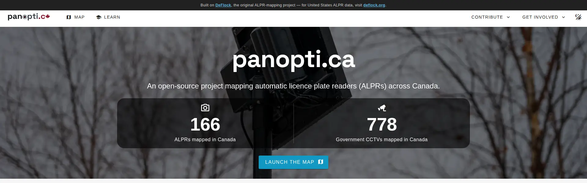

<p align="center">
  <picture>
    <source media="(prefers-color-scheme: dark)" srcset="branding/panoptica-dark.svg">
    
  </picture>
</p>

**A Canadian map and resource hub for automatic licence plate readers (ALPRs) and government surveillance cameras.**

[View the live site →](https://panopti.ca)



This repository is for the **content portal** for the panopti.ca project. It links to the **[map portal](https://maps.panopti.ca/)** where ALPRs and government CCTVs deployed across Canada are mapped out, explains how the technology works and why it matters, and gives people the tools to push back — public-records (ATIP/FOI) guidance, police-services-board context, and OpenStreetMap reporting instructions. All camera locations come from open data on OpenStreetMap.

**Looking for the map repository?** You can find that by clicking **[here](https://github.com/resistanceisliberty/panopti.ca)**!

---

## Built on DeFlock

panopti.ca is a fork of [**DeFlock**](https://deflock.org) (`FoggedLens/deflock`), the original crowdsourced ALPR-mapping project, adapted and localized for Canada.
What this fork changes:

- **Canadian focus.** Federal **ATIP** and provincial **FOI** processes (RCMP, MFIPPA/FIPPA, BC OIPC, Québec CAI), **police services boards**, *Charter* s. 8 privacy framing, and the vendors common here (Genetec, Flock's Canadian expansion).
- **Canadian data.** Counts and the linked map cover Canada only, sourced live from OpenStreetMap via the Overpass API.
- **No backend.** DeFlock's server-side stack (a Fastify API plus AWS / Directus / Zammad infrastructure) has been removed. panopti.ca is a fully static, pre-rendered SPA on Cloudflare Pages. The live counter reads the map's published data file directly.

---

## What happens here?

- **Map** — links to the live interactive map at [maps.panopti.ca](https://maps.panopti.ca) (ALPR + government CCTV locations across Canada, on a self-hosted basemap).
- **Learn** — what ALPRs are, how they track ordinary people, and the privacy and *Charter* concerns specific to Canada.
- **Report** — how to add a camera to OpenStreetMap using the standardized `surveillance:type=ALPR` tagging, via the OSM iD editor.
- **Identify** — a growing reference of ALPR makes/models with photos and the correct OSM tags (tag presets fetched from DeFlock's CMS).
- **Public Records & City Council** — how to file ATIP/FOI requests and engage municipal councils and police services boards about ALPR programs.
- **Contact** — reach the project at `contact@panopti.ca`.

---

## Tech stack

- **Vue 3** + **TypeScript**, **Vuetify** component library
- **Vite** with **vite-ssg** — every route is pre-rendered to static HTML at build time (good SEO, fast first paint), then hydrates into an SPA
- **Pinia** (state) and **Vue Router**
- **@unhead/vue** for per-route titles / meta / JSON-LD
- **countup.js** for the live ALPR/CCTV counters
- Hosted on **Cloudflare Pages**; security headers + a scoped Content-Security-Policy ship via [`webapp/public/_headers`](webapp/public/_headers)

### Data & external dependencies

- **Camera data** — published by the map repo's OpenStreetMap/Overpass pipeline (refreshed several times a day) as `cameras-ca.json`; the landing-page counter fetches it live from `maps.panopti.ca`.
- **OSM tag presets** — the Report/Identify pages fetch vendor tagging presets from DeFlock's hosted CMS (`cms.deflock.me`). This is the only third-party runtime dependency.

---

## Development

Requires [**bun**](https://bun.sh/).

```bash
cd webapp
bun install
bun run dev        # dev server with HMR
bun run build      # vite-ssg production build → webapp/dist
bun run preview    # preview the production build
```

> Cloudflare Pages builds with **Node 20** (`npm run build`, output directory `dist`, root directory `webapp`). The pre-render step runs the SSR bundle under Node, so building with Node (not just bun) locally is the closest match to the deploy.

---

## Contributing

Issues and pull requests are welcome — fixes, Canadian content/sources, and identification references especially.

1. Fork the repository
2. Make your changes
3. Open a pull request against `main`

---

## Credits & licence

- Built on [**DeFlock**](https://deflock.org) — the original ALPR-mapping project. Please support it.
- Camera location data © **OpenStreetMap** contributors, available under the [Open Database License (ODbL)](https://www.openstreetmap.org/copyright).
- Code inherits DeFlock's upstream licence; see the source history for details.
